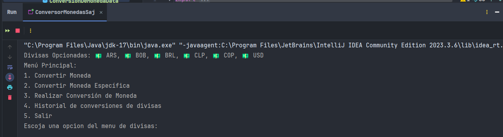
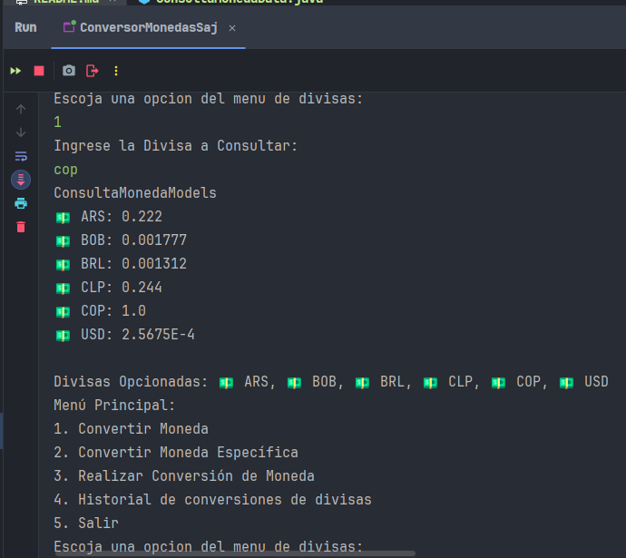
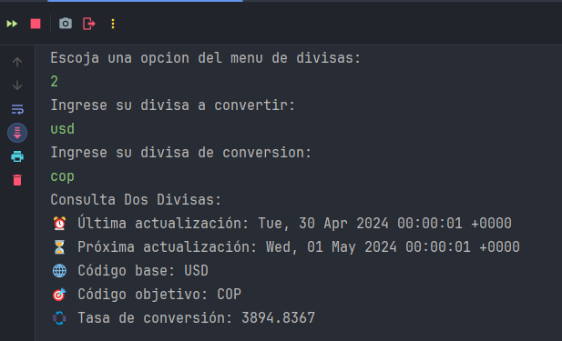
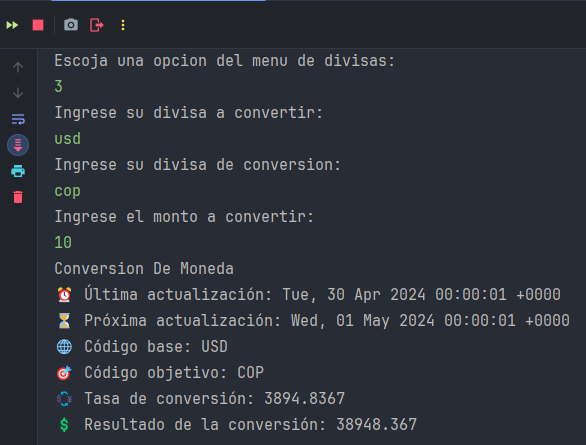
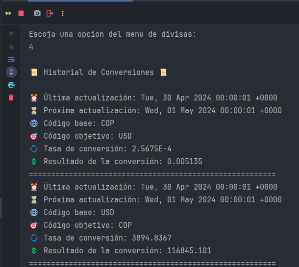

<<<<<<< HEAD

<h1>Programa de Conversión de Divisas 💱</h1>

<h2>

## Descripción

</h2>
<h4>

Este programa de conversión de moneda permite al usuarios acceder a información actualizada sobre los tipos de cambio de divisas, realizar conversiones entre diferentes divisas y mantener un historial de transacciones. Utiliza la <a href="https://www.exchangerate-api.com/" target="_blank" rel="noopener noreferrer">ExchangeRate-API</a> para obtener datos precisos y actualizados sobre los tipos de cambio.
</h4>

## Características Principales

### Ver Valores de Moneda
  
  Esta opción permite a los usuarios ver los valores actuales de diferentes divisas disponibles. Proporciona una visión general de los tipos de cambio más recientes.

### Consultar Moneda Específica

Con esta función, los usuarios pueden consultar el valor específico de una moneda seleccionada. Es útil para obtener información detallada sobre una divisa en particular.

### Convertir Moneda

Permite a los usuarios convertir entre diferentes divisas utilizando los tipos de cambio actuales. Es una herramienta práctica para realizar transacciones financieras internacionales.

### Historial de Conversiones

Esta función registra y muestra el historial de todas las conversiones realizadas por el usuario. Facilita el seguimiento de transacciones pasadas.

## Arquitectura del Proyecto

### Clase de Conexión a la API

Se ha implementado una clase dedicada para gestionar la conexión a la ExchangeRate-API. Esta clase utiliza la biblioteca estándar java.net.HttpURLConnection para establecer conexiones HTTP seguras y enviar solicitudes GET a la URL de la API.

### Uso de la Biblioteca Gson

Para procesar datos JSON recibidos de la API, el proyecto hace uso de la biblioteca Gson. Esta herramienta convierte fácilmente objetos JSON a objetos Java y viceversa, facilitando la manipulación de datos en el proyecto.

### Clase de Almacenamiento de Datos

Además, se ha diseñado una clase específica para almacenar datos de conversión. Esta clase registra todas las conversiones realizadas durante la sesión de usuario actual, lo que permite un acceso rápido y eficiente al historial de transacciones.

## Beneficios del Proyecto

- Proporciona una interfaz intuitiva y fácil de usar para la conversión de moneda.
- Utiliza datos precisos y actualizados de la ExchangeRate-API.
- Ofrece un historial detallado de todas las transacciones realizadas.
- Implementa una arquitectura robusta y escalable para garantizar un rendimiento óptimo.

Con esta arquitectura y características, el proyecto ofrece una solución integral y efectiva para las necesidades de conversión de divisas de los usuarios, combinando tecnología moderna y facilidad de uso.
=======
# ConversionMonedas
>>>>>>> 9b83603cb4a5e066508fe8a7f49f25a24ca9ff95
